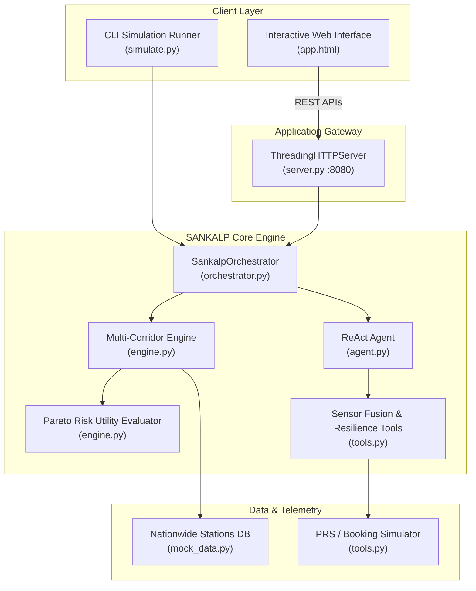

# SANKALP
> **System for Autonomous Navigation, Knowledge-driven Adaptation, and Logistic Planning**

[](https://priyanshu-2308.github.io/SANKALP/)
[](tests/)
[](https://www.python.org/)
[](LICENSE)
[](#architecture)

SANKALP is an **autonomous journey recovery platform** designed to resolve high-stakes travel disruptions across Indian transit corridors (Indian Railways, intercity sleeper buses, and air feeders). When trains are abruptly cancelled, delayed, or connecting legs break, SANKALP ingests real-time telemetry, generates Pareto-optimal multi-modal itineraries, and executes consequential actions under human-in-the-loop governance.

> [!WARNING]
> **Notice:** The live web interface at **[https://priyanshu-2308.github.io/SANKALP/](https://priyanshu-2308.github.io/SANKALP/)** is an interactive proof-of-concept prototype and is **not production-grade yet**. External railway PRS transactional gateways and live sensor telemetry are simulated.

---

## 🌟 Key Capabilities

1. **Autonomous Multi-Modal Corridor Pathfinding**:
   - Dynamic cross-modal route generation across 50+ nationwide transport hubs.
   - Combines Superfast Indian Railways, Volvo/BharatBenz AC Sleeper buses (VRL, Orange, Hans, KSRTC), air feeders (IndiGo, Air India), and rapid intra-city last-mile links (Namma Metro Purple Line, Delhi Airport Express, Uber Green, Pre-paid Auto).

2. **Deterministic Decision Science & Pareto Utility Scoring**:
   - Multi-objective utility scoring function balancing arrival certainty, fare cost, transfer fatigue, and slack time to destination deadlines.
   - Monte Carlo delay simulation with beta-distributed transit delays for realistic risk profiling.

3. **Autonomous ReAct Agent & Sensor Fusion**:
   - ReAct (Reasoning + Acting) execution trace with Reflexion self-correction.
   - Resolves conflicting real-time telemetry (e.g. stale NTES GPS vs. live crowdsourced RailMadad / Locomotive IoT telemetry) using Bayesian sensor fusion.

4. **Fault-Tolerant Booking Gateway & Consequential Actions**:
   - Circuit-breaker pattern handling IRCTC PRS gateway 503 errors with exponential backoff and alternate gateway fallback.
   - Auto-TDR (Ticket Deposit Receipt) calculation recovering cancelled train fares.
   - Time-locked UPI dynamic payment intents with countdown hold timers.

5. **Production Web Application UI**:
   - Midnight slate dark theme with rich visual hierarchy (zero neon).
   - Static Pareto Top Recommendation Bento Box card.
   - Segmented mode filter tabs (*All Corridors*, *Superfast Rail*, *AC Sleeper Bus*, *Rail + Bus*, *Air Feeder*).
   - Electronic Boarding Pass & Consequential Booking Gate with QR authorization.
   - Built-in Chaos Switchboard for real-time stress testing of edge cases.

---

## 🏛️ System Architecture



---

## 🚀 Quickstart

### Prerequisites
- Python 3.10+ (Standard library only; zero external pip dependencies required to run the core engine and server).

### 1. Start the Live Application Server
```bash
python server.py
```
Open your browser at:
- **Live Demo (GitHub Pages)**: [https://priyanshu-2308.github.io/SANKALP/](https://priyanshu-2308.github.io/SANKALP/) *(Prototype demo, not production-grade yet)*
- **Local Application Server**: [http://localhost:8080/](http://localhost:8080/)

### 2. Run the Interactive Simulation & Edge Case Suite
```bash
# Automated end-to-end corridor recovery demonstration
python simulate.py

# Interactive step-by-step mode
python simulate.py --interactive

# Test conflicting telemetry sensor fusion
python simulate.py --conflict

# Test IRCTC PRS gateway 503 circuit-breaker resilience
python simulate.py --resilience

# Test dynamic constraint mutation mid-process
python simulate.py --mutation

# Run all edge case simulations
python simulate.py --all-edge-cases
```

### 3. Run Automated Unit Tests
```bash
python -m unittest discover -s tests
```
All 13 regression and routing tests run in under 0.15s.

---

## 🔌 Core API Endpoints

| Method | Endpoint | Description |
|---|---|---|
| `GET` | `/api/status` | Current belief state, auto-refund amount, and candidate recovery plans |
| `GET` | `/api/stations` | Complete nationwide station directory |
| `GET` | `/api/stations/search?q={query}` | Autocomplete search for stations by code, name, city, or state |
| `POST` | `/api/route` | Dynamic multi-corridor pathfinding for specified origin, destination, and budget |
| `POST` | `/api/pnr/lookup` | Instant PNR status lookup and auto-triage of cancelled bookings |
| `POST` | `/api/book/prep` | Prepares consequential booking with cryptographic hash and UPI intent URI |
| `POST` | `/api/chaos/conflict` | Simulates conflicting telemetry sensor fusion |
| `POST` | `/api/chaos/gateway` | Simulates IRCTC PRS gateway 503 outage & circuit-breaker recovery |
| `POST` | `/api/chaos/delay` | Injects transit leg delay & triggers autonomous re-planning |
| `POST` | `/api/chaos/mutation` | Dynamically mutates deadline & budget constraints mid-process |

---

## 📂 Repository Structure

```
SANKALP/
├── sankalp/                    # Core Python engine package
│   ├── __init__.py             # Package descriptor
│   ├── agent.py                # ReAct + Reflexion agent swarm implementation
│   ├── engine.py               # Pathfinding & Pareto multi-objective decision science
│   ├── mock_data.py            # 50+ station directory & dynamic transit schedules
│   ├── models.py               # Pydantic-style dataclass domain models
│   ├── orchestrator.py         # Central coordinator exposing high-level workflow APIs
│   └── tools.py                # Sensor fusion, circuit-breaker, PRS booking simulator
├── tests/                      # Automated test suite
│   ├── test_generic_routing.py # Multi-corridor generic routing tests
│   └── test_sankalp.py         # End-to-end decision science & edge case tests
├── index.html                  # Production web app & GitHub Pages entrypoint
├── app.html                    # Production web application interface
├── offline_bundle.js           # Client-side static fallback dataset for GitHub Pages
├── server.py                   # Zero-dependency HTTP gateway & REST API server
├── simulate.py                 # CLI simulation & chaos scenario runner
├── SARCATHON_PS.md             # Problem statement and system architecture blueprint
└── README.md                   # Project documentation
```

---

## 🛡️ License

This project is licensed under the MIT License.
