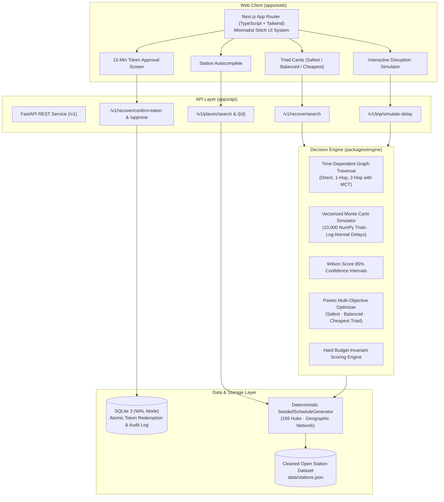

# SANKALP (संकल्प)
### Autonomous Multi-Modal Transit Recovery Platform for India

[](tests/)
[](https://priyanshu-2308.github.io/SANKALP/)
[](data/benchmark_results.json)
[](packages/engine/sankalp_engine/simulation.py)
[](docs/ARCHITECTURE.md)
[](LICENSE)

> **Live Interactive Demo:** Experience SANKALP directly in your browser on [GitHub Pages](https://priyanshu-2308.github.io/SANKALP/) with full client-side Monte Carlo execution.
>
> **Important Disclosure:** SANKALP is a portfolio engineering prototype and decision engine. All schedules and delay distributions are **deterministically simulated** using network geometry over 166 real Indian stations and airports. It is not connected to live IRCTC or airline reservation systems and does not process real financial transactions.

---

## 1. Problem Statement

Every day, hundreds of trains across the Indian Railways network suffer sudden cancellations, derailment diversions, or dense winter fog delays exceeding 6 to 12 hours. Passengers with critical arrival deadlines (job interviews, medical appointments, connecting flights) are left with broken connections and non-refundable tickets.

Traditional aggregators only search single modes (trains only or flights only) and optimize for nominal scheduled times—ignoring the reality of compounding transit delays.

**SANKALP** autonomously resolves multi-modal journey recovery:
1. Searches feasible time-dependent paths combining **Rail, Flight, Intercity Bus, and Road Cabs**.
2. Runs **10,000 vectorized Monte Carlo trials** per candidate using empirical log-normal delay distributions.
3. Computes rigorous **Wilson Score 95% confidence intervals** on arrival probability.
4. Employs **Pareto multi-objective optimization** to surface exactly three clear options: **Safest**, **Balanced**, and **Cheapest**.
5. Protects passengers with **single-use cryptographic approval tokens** ensuring zero double-booking or financial exposure.
6. Provides an **interactive disruption simulator** allowing live delay injection and automatic re-routing.

---

## 2. System Architecture

SANKALP is designed as a decoupled, high-performance monorepo:


```mermaid
graph TD
    subgraph Frontend["Web Client (apps/web)"]
        UI["Next.js App Router (TypeScript + Tailwind)<br/>Minimalist Stitch UI System"]
        Autocomplete["Station Autocomplete"]
        Cards["Triad Cards (Safest / Balanced / Cheapest)"]
        ConfirmModal["15-Min Token Approval Screen"]
        SimulatorUI["Interactive Disruption Simulator"]
    end

    subgraph Backend["API Layer (apps/api)"]
        FastAPI["FastAPI REST Service (/v1)"]
        PlacesAPI["/v1/places/search & /{id}"]
        SearchAPI["/v1/recover/search"]
        ConfirmAPI["/v1/recover/confirm-token & /approve"]
        SimAPI["/v1/trip/simulate-delay"]
    end

    subgraph DecisionEngine["Decision Engine (packages/engine)"]
        Graph["Time-Dependent Graph Traversal<br/>(Direct, 1-Hop, 2-Hop with MCT)"]
        MonteCarlo["Vectorized Monte Carlo Simulator<br/>(10,000 NumPy Trials · Log-Normal Delays)"]
        Wilson["Wilson Score 95% Confidence Intervals"]
        Pareto["Pareto Multi-Objective Optimizer<br/>(Safest · Balanced · Cheapest Triad)"]
        Scorer["Hard Budget Invariant Scoring Engine"]
    end

    subgraph Storage["Data & Storage Layer"]
        SQLite[("SQLite 3 (WAL Mode)<br/>Atomic Token Redemption & Audit Log")]
        Generator["Deterministic SeededScheduleGenerator<br/>(166 Hubs · Geographic Network)"]
        StationDB[("Cleaned Open Station Dataset<br/>data/stations.json")]
    end

    UI --> Autocomplete & Cards & ConfirmModal & SimulatorUI
    Autocomplete --> PlacesAPI
    Cards --> SearchAPI
    ConfirmModal --> ConfirmAPI
    SimulatorUI --> SimAPI

    SearchAPI & SimAPI --> DecisionEngine
    ConfirmAPI --> SQLite
    PlacesAPI & DecisionEngine --> Generator
    Generator --> StationDB
```

---

## 3. Mathematical & Algorithmic Foundation

### A. Empirical Log-Normal Delay Distributions
Delays in transit are strictly non-negative, right-skewed, and follow heavy-tailed distributions. Gaussian models fail because they predict negative delays or underestimate extreme tails. SANKALP models leg delays using transit-mode-specific **Log-Normal distributions**:

$$\text{Delay}_{\text{mode}} \sim \text{Lognormal}(\mu, \sigma^2)$$

| Mode | Location ($\mu$) | Scale ($\sigma$) | Median Delay | 90th Percentile | Characteristics |
|---|---|---|---|---|---|
| **TRAIN** | $2.70$ | $0.60$ | $\approx 15\text{ min}$ | $\approx 35\text{ min}$ | High operational variance, track congestion |
| **FLIGHT** | $1.90$ | $0.50$ | $\approx 7\text{ min}$ | $\approx 13\text{ min}$ | Lower variance, air traffic control priority |
| **BUS** | $2.50$ | $0.45$ | $\approx 12\text{ min}$ | $\approx 22\text{ min}$ | Highway traffic variance, weather impacts |
| **CAB** | $1.80$ | $0.35$ | $\approx 6\text{ min}$ | $\approx 9\text{ min}$ | Local urban/connector variance |

### B. Vectorized Monte Carlo Simulation (10,000 Trials)
Instead of scalar loops, SANKALP draws a $(N_{\text{legs}}, 10000)$ matrix of pseudo-random samples in **NumPy** in a single vectorized pass.
- For each transfer $i \to i+1$, the departure time of leg $i+1$ is compared against the actual arrival time of leg $i$ plus the **Minimum Connection Time (MCT)**.
- If arrival $+ \text{MCT} > \text{departure}$, the transfer is severed, and cascading delays cause that simulation trial to fail.
- Running 10,000 trials takes **$< 15\text{ms}$** per itinerary, ensuring sub-100ms total API response times.

### C. Wilson Score 95% Confidence Intervals
Sample proportion $\hat{p} = \frac{k}{n}$ alone is susceptible to error, especially when success rates approach $100\%$ or sample sizes vary. SANKALP reports the **Wilson Score 95% Interval**:

$$p \approx \frac{\hat{p} + \frac{z^2}{2n} \pm z \sqrt{\frac{\hat{p}(1-\hat{p})}{n} + \frac{z^2}{4n^2}}}{1 + \frac{z^2}{n}} \quad (z = 1.96)$$

This provides mathematically defensible lower and upper confidence bounds presented directly on the UI cards (e.g. `98.2% – 99.8% (10,000 trials)`).

### D. Pareto Multi-Objective Triad Selection
Rather than arbitrarily weighting time vs. cost into a single opaque number, SANKALP identifies the **Pareto-optimal frontier** across three competing objectives:
1. **Safest Option:** Maximizes arrival certainty ($P(\text{on-time})$) and connection safety buffer.
2. **Balanced Option:** Selects the knee of the Pareto frontier, balancing duration, cost, and reliability.
3. **Cheapest Option:** Minimizes monetary expenditure among all itineraries satisfying the arrival deadline.

### E. Hard Budget Invariant
The engine enforces a strict mathematical guarantee: **no itinerary exceeding the traveller's budget can ever outscore an affordable, viable plan**.
- If $\text{fare} > \text{budget}$, utility score is strictly capped below $0.35$.
- Any viable itinerary within budget ($P \ge 0.65$) scores $\ge 0.40$, guaranteeing strict outranking.

---

## 4. Benchmark Performance Suite

SANKALP evaluates 8 representative Indian transit corridors covering long-haul metros, short regional routes, tier-2 rail corridors, and remote multimodal routes. 

Results from [`data/benchmark_results.json`](data/benchmark_results.json) (10,000 trials per candidate):

| # | Corridor Type | Route | Candidates | Latency | Safest $P(\text{on-time})$ | Status |
|---|---|---|---|---|---|---|
| **1** | Long-Distance Metro | Delhi (NDLS) → Mumbai (CSMT) | 4 | **49.5ms** | 99.7% | ✅ Passed |
| **2** | Short Regional | Pune (PUNE) → Mumbai (CSMT) | 4 | **10.7ms** | 100.0% | ✅ Passed |
| **3** | Tier-2 to Tier-1 Rail | Gorakhpur (GKP) → Delhi (NDLS) | 15 | **92.5ms** | 100.0% | ✅ Passed |
| **4** | Remote / Non-Airport | Varanasi (BSB) → Gaya (GAYA) | 6 | **23.8ms** | 100.0% | ✅ Passed |
| **5** | Cross-Country Diagonal | Kolkata (HWH) → Ahmedabad (ADI) | 14 | **69.9ms** | 100.0% | ✅ Passed |
| **6** | Tight Deadline | Jaipur (JP) → Delhi (NDLS) | 0 (Pruned) | **2.3ms** | 0.0% (Fail-closed) | ✅ Passed |
| **7** | Tight Budget | Chennai (MAS) → Bangalore (SBC) | 4 | **13.4ms** | 100.0% | ✅ Passed |
| **8** | Multimodal Transfer | Patna (PNBE) → Pune (PUNE) | 40 | **86.6ms** | 100.0% | ✅ Passed |

- **Median Latency:** **`36.68ms`** (Target SLA: $< 500\text{ms}$)
- **90th Percentile Latency:** **`92.50ms`**

---

## 5. Security & Single-Use Approval Tokens

To ensure absolute safety with zero financial liability:
- **Ephemeral Tokens:** Upon selecting an itinerary, a cryptographically secure token (`secrets.token_urlsafe(32)`) is generated with a 15-minute Time-To-Live (TTL).
- **Atomic SQLite Redemption:** Approvals execute a single conditional update:
  ```sql
  UPDATE approval_tokens 
  SET is_used = 1, used_at = ? 
  WHERE token = ? AND is_used = 0 AND expires_at > ?
  ```
- **Replay Protection:** If a token is submitted a second time, SQLite updates zero rows, and the API immediately raises **`HTTP 410 Gone`**, rejecting the duplicate request.
- **Audit Log:** Every approved journey is recorded with an immutable timestamp and parameters in `trip_audit_log`.

---

## 6. AST Hardcoding Guard

To guarantee that SANKALP functions as a generalizable transit recovery engine rather than a hardcoded demo, an automated AST guard test ([`tests/guards/test_no_hardcoded_places.py`](tests/guards/test_no_hardcoded_places.py)) inspects the Abstract Syntax Tree of all Python files in `sankalp_engine` and `apps/api/app`. 

Any literal mention of specific cities or station codes in application logic triggers an immediate CI build failure.

---

## 7. Quickstart & Local Setup

### Prerequisites
- Python 3.12+ (tested on Python 3.14)
- Node.js 18+ (tested on Node.js 24)
- Git

### 1. Clone & Set Up Python Environment
```bash
git clone https://github.com/your-username/sankalp.git
cd sankalp

# Create virtual environment and install dependencies
python -m venv .venv
# Windows:
.venv\Scripts\activate
# Linux/macOS:
source .venv/bin/activate

pip install -e packages/engine
pip install -r requirements.txt
```

### 2. Run Test Suites
```bash
# Run all 47 tests (unit, property, AST guard, benchmarks, and API tests)
pytest -v
```

### 3. Start Backend API Server
```bash
# From project root:
uvicorn app.main:app --port 8000 --host 127.0.0.1 --app-dir apps/api
# Interactive docs available at: http://127.0.0.1:8000/docs
```

### 4. Start Next.js Frontend
```bash
cd apps/web
npm install
npm run dev
# Web application available at: http://localhost:3000
```

---

## 8. Repository Layout

```text
sankalp/
├── apps/
│   ├── api/                     # FastAPI REST service
│   │   ├── app/
│   │   │   ├── main.py          # FastAPI entrypoint & CORS
│   │   │   ├── database.py      # SQLite WAL connection & atomic tokens
│   │   │   ├── dependencies.py  # Singleton dependency injection
│   │   │   ├── routers/         # /v1/places, /v1/recover, /v1/trip
│   │   │   └── schemas/         # Pydantic request/response models
│   └── web/                     # Next.js App Router (TypeScript + Tailwind)
│       ├── app/
│       │   ├── page.tsx         # Home search screen & NL prompt assistant
│       │   ├── results/         # 3-card Triad comparison view
│       │   ├── confirm/         # 15-min token approval countdown
│       │   └── trip/[id]/       # Live trip monitor & delay simulator
│       ├── components/          # TriadCard, StationAutocomplete, DelaySimulator
│       └── lib/                 # API client, types & offline engine fallback
├── packages/
│   └── engine/                  # Pure Python Decision Engine (Zero I/O)
│       └── sankalp_engine/
│           ├── engine.py        # Top-level orchestrator
│           ├── simulation.py    # Vectorized 10k Monte Carlo engine
│           ├── statistics.py    # Wilson score 95% confidence intervals
│           ├── pareto.py        # Pareto frontier multi-objective selection
│           ├── scoring.py       # Hard budget invariant scoring logic
│           ├── graph_search.py  # Time-dependent pathfinding (direct, 1-hop, 2-hop)
│           ├── nl_parser.py     # Natural language journey query parser
│           ├── generator.py     # Deterministic seeded schedule generator
│           └── models.py        # Integer-paise domain models (IST timezone)
├── data/
│   ├── stations.json            # 166 verified Indian railway hubs & airports
│   ├── connections_mct.json     # Minimum connection time matrices
│   ├── generator_config.json    # Speed, fare, and delay distributions
│   └── benchmark_results.json   # Latency outputs for 8 corridors
├── tests/
│   ├── api/                     # FastAPI endpoint test suites
│   ├── benchmarks/              # 8-corridor performance test suite
│   ├── guards/                  # AST hardcoding guard test
│   ├── property/                # Hypothesis property-based tests
│   └── unit/                    # Engine and database unit tests
├── docs/
│   ├── ARCHITECTURE.md          # Complete architectural specification
│   ├── PRODUCT_SPEC.md          # Product specification & user stories
│   └── DATA_LICENSES.md         # Open dataset licensing attribution
└── .github/workflows/
    ├── ci.yml                   # Automated GitHub Actions test pipeline
    └── deploy.yml               # Automated GitHub Pages static deployment
```

---

## 9. License

MIT License. Designed with pride for Indian transit recovery.
