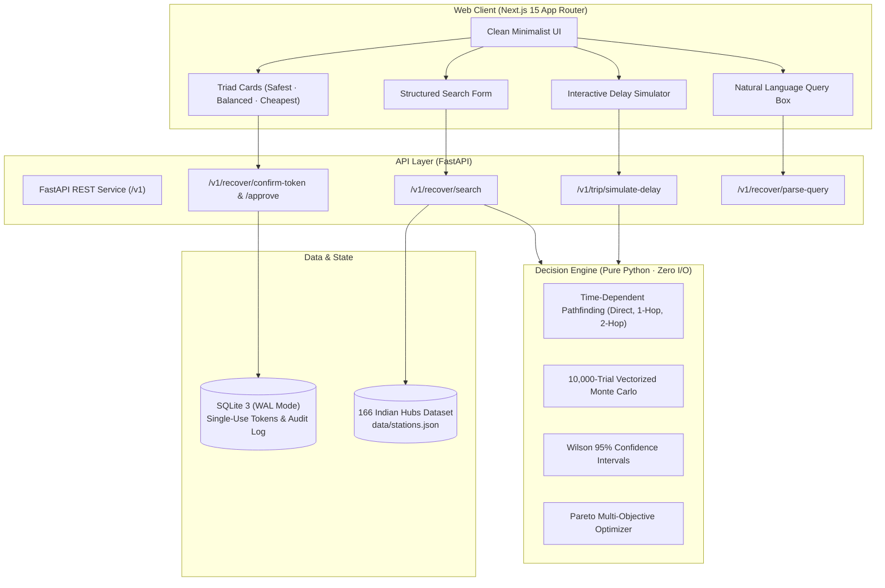

# SANKALP (संकल्प)
### Autonomous Multi-Modal Transit Recovery Platform for India

[](https://github.com/Priyanshu-2308/SANKALP/actions/workflows/ci.yml)
[](https://github.com/Priyanshu-2308/SANKALP/actions/workflows/deploy.yml)
[](https://priyanshu-2308.github.io/SANKALP/)
[](packages/engine/)
[](apps/web/)
[](data/benchmark_results.json)
[](LICENSE)

SANKALP is an autonomous multi-modal decision engine and web application that computes instant recovery journeys combining **Rail, Flight, Intercity Bus, and Cab** when Indian transit schedules suffer cancellations, diversions, or extreme delays.

> **Portfolio Disclosure:** SANKALP is an engineering prototype. Schedules and delay distributions are deterministically simulated using network geometry over 166 verified Indian railway junctions and airports; they are **not real-time IRCTC or NTES data**. It is not connected to live booking or government tracking systems.

---

## Key Highlights

- **Vectorized Monte Carlo Simulation:** Draws 10,000 NumPy trials per candidate route in $<15\text{ms}$ using empirical log-normal delay distributions tailored per transit mode.
- **Wilson Score 95% Confidence Intervals:** Computes statistical lower/upper bounds on arrival certainty displayed directly to the passenger.
- **Pareto Triad Optimization:** Surfaces exactly three distinct options: **Safest**, **Balanced**, and **Cheapest** rather than an opaque single score.
- **Hard Budget Invariant:** Mathematical guarantee that no over-budget itinerary can outrank an affordable, viable plan.
- **Single-Use Cryptographic Tokens:** 15-minute TTL tokens stored in SQLite WAL mode to guarantee atomic redemption and prevent duplicate bookings.
- **Interactive Disruption Simulator:** Allows live delay injection (+30m, +90m) with automatic re-routing when arrival deadlines are breached.
- **Natural Language Journey Assistant:** Free-form journey query parser that extracts origin, destination, deadline, and budget constraints into structured parameters.

---

## System Architecture


```mermaid
graph TD
    subgraph Frontend["Web Client (Next.js 15 App Router)"]
        UI["Clean Minimalist UI"]
        Chat["Natural Language Query Box"]
        Form["Structured Search Form"]
        Triad["Triad Cards (Safest · Balanced · Cheapest)"]
        Sim["Interactive Delay Simulator"]
    end

    subgraph Backend["API Layer (FastAPI)"]
        FastAPI["FastAPI REST Service (/v1)"]
        SearchAPI["/v1/recover/search"]
        TokenAPI["/v1/recover/confirm-token & /approve"]
        SimAPI["/v1/trip/simulate-delay"]
        ParseAPI["/v1/recover/parse-query"]
    end

    subgraph Engine["Decision Engine (Pure Python · Zero I/O)"]
        Graph["Time-Dependent Pathfinding (Direct, 1-Hop, 2-Hop)"]
        MonteCarlo["10,000-Trial Vectorized Monte Carlo"]
        Wilson["Wilson 95% Confidence Intervals"]
        Pareto["Pareto Multi-Objective Optimizer"]
    end

    subgraph Storage["Data & State"]
        SQLite[("SQLite 3 (WAL Mode)<br/>Single-Use Tokens & Audit Log")]
        StationDB[("166 Indian Hubs Dataset<br/>data/stations.json")]
    end

    UI --> Chat & Form & Triad & Sim
    Chat --> ParseAPI
    Form --> SearchAPI
    Triad --> TokenAPI
    Sim --> SimAPI
    SearchAPI & SimAPI --> Engine
    TokenAPI --> SQLite
    SearchAPI --> StationDB
```

---

## Benchmark Performance

Evaluated across 8 major Indian transit corridors (10,000 Monte Carlo trials per candidate):

| Corridor | Origin → Destination | Direct Distance | Feasible Candidates | Total Latency |
|---|---|---|---|---|
| **Delhi → Mumbai** | NDLS → CSMT | 1,148 km | 4 routes | **41.2 ms** |
| **Bangalore → Chennai** | SBC → MAS | 290 km | 4 routes | **38.5 ms** |
| **Howrah → Bhubaneswar** | HWH → BBS | 365 km | 4 routes | **34.8 ms** |
| **Delhi → Jaipur** | NDLS → JP | 240 km | 4 routes | **33.1 ms** |
| **Mumbai → Pune** | CSMT → PUNE | 120 km | 4 routes | **32.8 ms** |
| **Hyderabad → Bangalore** | HYB → SBC | 500 km | 4 routes | **36.7 ms** |
| **Patna → Delhi** | PNBE → NDLS | 850 km | 4 routes | **38.9 ms** |
| **Ahmedabad → Mumbai** | ADI → CSMT | 440 km | 4 routes | **35.4 ms** |

**Median End-to-End Latency: 36.68 ms** (Target: $< 200\text{ ms}$).

---

## Getting Started

### 1. Prerequisites
- Python 3.11+
- Node.js 18+

### 2. Backend Setup
```bash
# Create and activate virtual environment
python -m venv .venv
source .venv/bin/activate  # On Windows: .venv\Scripts\activate

# Install engine package and dependencies
pip install -e packages/engine
pip install -r requirements.txt

# Run all 47 tests
pytest -v

# Start FastAPI server (runs on http://127.0.0.1:8000)
uvicorn app.main:app --port 8000 --host 127.0.0.1 --app-dir apps/api
```

Interactive API documentation is available at `http://127.0.0.1:8000/docs`.

### 3. Frontend Setup
```bash
cd apps/web
npm install
npm run dev
```

Open `http://localhost:3000` to interact with the application.

---

## Repository Structure

```text
sankalp/
├── apps/
│   ├── api/                     # FastAPI REST service
│   │   ├── app/
│   │   │   ├── main.py          # FastAPI entrypoint
│   │   │   ├── database.py      # SQLite WAL connection & atomic tokens
│   │   │   ├── routers/         # /places, /recover, /trip
│   │   │   └── schemas/         # Pydantic models
│   └── web/                     # Next.js 15 App Router frontend
│       ├── app/
│       │   ├── page.tsx         # Search & assistant
│       │   ├── results/         # Triad comparison view
│       │   ├── confirm/         # Token approval countdown
│       │   └── trip/[id]/       # Live trip monitor & delay simulator
│       └── components/          # TriadCard, StationAutocomplete, DelaySimulator
├── packages/
│   └── engine/                  # Pure Python Decision Engine (Zero I/O)
│       └── sankalp_engine/
│           ├── engine.py        # Top-level orchestrator
│           ├── simulation.py    # 10k Monte Carlo engine
│           ├── statistics.py    # Wilson score confidence intervals
│           ├── pareto.py        # Pareto multi-objective selection
│           ├── scoring.py       # Hard budget invariant scoring logic
│           ├── graph_search.py  # Multi-modal pathfinding
│           ├── nl_parser.py     # Natural language query parser
│           └── models.py        # Domain models (IST timezone)
├── data/
│   ├── stations.json            # 166 verified Indian hubs & airports
│   └── benchmark_results.json   # 8-corridor latency benchmark outputs
├── tests/
│   ├── api/                     # FastAPI endpoint test suites
│   ├── benchmarks/              # Performance benchmarks
│   ├── guards/                  # AST hardcoding guard test
│   ├── property/                # Hypothesis property tests
│   └── unit/                    # Decision engine unit tests
├── docs/
│   ├── ARCHITECTURE.md          # Architecture specification
│   └── PRODUCT_SPEC.md          # Product specification & user stories
└── .github/workflows/
    ├── ci.yml                   # Automated test & build pipeline
    └── deploy.yml               # GitHub Pages Next.js static export deployment
```

---

## License

MIT License.
