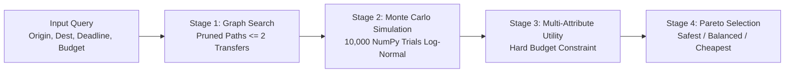

# SANKALP — System Architecture & Technical Design
**Version:** 1.0.0  
**Status:** Approved for Implementation (Phase 0)  
**Package Namespace:** `sankalp`  

---

## 1. System Overview & Architectural Tenets

SANKALP is structured as a lean, decoupled monorepo designed for clarity, testability, and portfolio presentation. It intentionally avoids distributed microservices, message queues, and heavy infrastructure in favor of clean architectural boundaries, deterministic logic, and high performance.

```mermaid
graph TD
    Client["apps/web<br/>(Next.js App Router + Tailwind)"]
    API["apps/api<br/>(FastAPI /v1 REST API)"]
    Engine["packages/engine<br/>(Pure Python Decision Engine)"]
    DataSource["TransportDataSource<br/>(Abstract Protocol)"]
    Gen["SeededScheduleGenerator<br/>(Deterministic Generator)"]
    StationData["data/stations.json<br/>(Cleaned Open Dataset)"]
    DB[("SQLite Database<br/>(Audit Log & Approval Tokens)")]

    Client -->|HTTP / JSON| API
    API -->|In-Process Call| Engine
    API -->|Direct Queries| DB
    Engine -->|Queries Graph & Schedules| DataSource
    DataSource <|.. Gen
    Gen --> StationData
```

### Core Architectural Tenets
1. **Zero I/O in the Engine:** `packages/engine` is a pure mathematical library with zero network calls, disk I/O, or database dependencies. It accepts domain objects, executes graph search and vectorized Monte Carlo simulation, and returns typed results.
2. **Honest Data Architecture:** Since live Indian transit APIs are not publicly or freely available, all schedule and delay data is generated deterministically by `SeededScheduleGenerator` behind a clean `TransportDataSource` protocol. All responses and views are labeled `"Simulated schedules"`.
3. **Fail-Closed & Explicit:** If a corridor is impossible within budget or deadline, the system returns an explicit reason. It never falls back silently to a mock default route.
4. **Zero Financial Exposure:** No credit card, bank, or UPI data is ever handled. The approval flow uses single-use cryptographic tokens with short TTLs stored in SQLite.

---

## 2. Monorepo Directory Structure

```text
sankalp/
├── apps/
│   ├── api/                     # FastAPI backend application (Python 3.12)
│   │   ├── app/
│   │   │   ├── main.py          # FastAPI application entrypoint
│   │   │   ├── config.py        # Environment settings (pydantic-settings)
│   │   │   ├── database.py      # SQLite connection & schema migrations
│   │   │   ├── dependencies.py  # Dependency injection (Engine, DB)
│   │   │   ├── routers/
│   │   │   │   ├── v1_places.py # Station search & autocomplete
│   │   │   │   ├── v1_search.py # Multi-modal recovery search
│   │   │   │   ├── v1_confirm.py# Single-use token issue & approval
│   │   │   │   └── v1_simulate.py# Delay injection & re-plan endpoint
│   │   │   └── schemas/         # Pydantic request/response models
│   │   └── pyproject.toml
│   └── web/                     # Next.js 14/15 App Router (TypeScript + Tailwind)
│       ├── app/
│       │   ├── layout.tsx       # Root layout with Inter font & header/footer
│       │   ├── page.tsx         # Home search form
│       │   ├── results/         # Results 3-card comparison view
│       │   ├── confirm/         # Confirmation & human approval view
│       │   └── trip/            # Sentinel journey monitor & delay simulator
│       ├── components/          # Minimalist UI components (Stitch design)
│       ├── lib/                 # API client, formatting utils (paise -> INR)
│       ├── tailwind.config.ts   # Design tokens from Stitch (colors, spacing)
│       └── package.json
├── packages/
│   └── engine/                  # Pure Python Decision Engine
│       ├── sankalp_engine/
│       │   ├── __init__.py
│       │   ├── models.py        # Dataclasses: Place, Leg, Itinerary, Score
│       │   ├── graph_search.py  # Time-dependent graph traversal (<= 2 transfers)
│       │   ├── simulation.py    # Vectorized NumPy Monte Carlo (10k trials)
│       │   ├── statistics.py    # Log-normal delay sampling & Wilson confidence
│       │   ├── scoring.py       # Multi-attribute utility & hard budget rules
│       │   ├── pareto.py        # Pareto frontier extractor (Safest/Balanced/Cheapest)
│       │   └── explanations.py  # Plain-English justification & pruning classifier
│       └── pyproject.toml
├── data/
│   ├── stations.json            # Bundled open station dataset (CSV/JSON)
│   ├── connections_mct.json     # Minimum connection time tables by mode pair
│   └── generator_config.json    # Speed bands, delay distributions, fare rates
├── design/
│   └── stitch/                  # Extracted Stitch designs & screenshots (ID: 5680212938138663204)
├── docs/
│   ├── PRODUCT_SPEC.md
│   └── ARCHITECTURE.md
└── tests/
    ├── unit/                    # Unit tests for graph search, Monte Carlo, scoring
    ├── property/                # Hypothesis property-based tests (invariants)
    ├── api/                     # FastAPI testclient endpoints & token tests
    ├── guards/                  # AST guard verifying zero hardcoded place names
    └── benchmarks/              # 8-corridor latency & throughput benchmarks
```

---

## 3. The Decision Engine Architecture (`packages/engine`)

The engine is the centerpiece of the portfolio project. It operates in four deterministic stages:



### 3.1 Stage 1: Time-Dependent Multi-Modal Graph Search
- **Nodes ($V$):** Transit hubs (Railway Stations, Airports, Bus Terminals).
- **Edges ($E$):** Scheduled direct trips between hubs with mode $m \in \{\text{Train}, \text{Bus}, \text{Flight}\}$, scheduled departure $t_{\text{dep}}$, scheduled arrival $t_{\text{arr}}$, and fare $C$.
- **Transfer Constraints:**
  - Maximum transfers: $K \le 2$ (up to 3 legs).
  - Minimum Connection Time (MCT) enforced between consecutive legs $i$ and $i+1$:
    $$t_{\text{dep}, i+1} - t_{\text{arr}, i} \ge \text{MCT}(m_i, m_{i+1})$$
    Standard MCT matrix:
    - Train $\to$ Train: 30 minutes
    - Bus $\to$ Bus: 25 minutes
    - Flight $\to$ Flight: 60 minutes
    - Train/Bus $\to$ Flight: 120 minutes (airport check-in & security)
    - Flight $\to$ Train/Bus: 60 minutes (baggage reclaim & egress)
- **Deadline Bounding:** Any path where the scheduled final arrival $t_{\text{arr}, \text{final}} > \text{Deadline} - \text{Buffer}_{\text{min}}$ is pruned immediately prior to simulation.

### 3.2 Stage 2: Stochastic Delay Modeling & Monte Carlo Engine
Transit delays are notoriously asymmetric—trains and flights rarely arrive significantly early, but can suffer severe right-skewed delays due to congestion, weather, or mechanical failure.

#### 3.2.1 Log-Normal Delay Model
For each leg $i$ with transit mode $m$, the simulated delay $D_i$ (in minutes) follows a shifted log-normal distribution:
$$D_i \sim \text{Lognormal}(\mu_m, \sigma_m^2)$$
Parameters are calibrated per mode based on empirical Indian transport characteristics:
- **Rail ($\text{Train}$):** $\mu = 2.6, \sigma = 0.75$ (Median ~13 min, long right tail up to 180+ min).
- **Road ($\text{Bus}$):** $\mu = 2.3, \sigma = 0.60$ (Median ~10 min, traffic-dependent tail).
- **Air ($\text{Flight}$):** $\mu = 1.9, \sigma = 0.50$ (Median ~7 min, rare extreme delays).

#### 3.2.2 Delay Propagation & Cascading Misses
In a multi-leg itinerary $[L_1, L_2, \dots, L_k]$, delays cascade across connections:
1. Leg 1 actual arrival: $A_1 = t_{\text{arr}, 1} + D_1$.
2. Leg 2 available transfer slack: $S_1 = t_{\text{dep}, 2} - A_1$.
3. **Connection Check:** If $S_1 < \text{MCT}(m_1, m_2)$, **the connection is broken!** The trial is immediately marked as a failure ($T_{\text{final}} = \infty$).
4. If connection is made, Leg 2 departs on schedule or as delayed:
   $$T_{\text{dep}, 2} = \max(t_{\text{dep}, 2}, A_1 + \text{MCT}(m_1, m_2))$$
5. Cumulative arrival at final destination is evaluated against the user's deadline:
   $$\text{Success} = \begin{cases} 1 & \text{if } A_k \le \text{Deadline} \\ 0 & \text{otherwise} \end{cases}$$

#### 3.2.3 Vectorized Simulation & Wilson Confidence Interval
Instead of slow Python loops, the simulation generates a $(10000 \times k)$ matrix in NumPy with a seeded PRNG (`numpy.random.default_rng(seed)`):
- Number of trials: $N = 10,000$.
- On-time probability estimate: $\hat{p} = \frac{\sum \text{Successes}}{N}$.
- **Wilson Score 95% Confidence Interval:**
  $$\text{CI}_{95\%} = \frac{\hat{p} + \frac{z^2}{2N} \pm z \sqrt{\frac{\hat{p}(1-\hat{p})}{N} + \frac{z^2}{4N^2}}}{1 + \frac{z^2}{N}}$$
  where $z = 1.96$. For $N=10,000$, the margin of error is at most $\pm 0.98\%$, providing rock-solid confidence bounds for display (e.g. `94.2% ± 0.4%`).

### 3.3 Stage 3: Multi-Attribute Utility Function & Hard Constraints
Each viable candidate itinerary is evaluated on four normalized attributes:
1. **On-time Probability:** $S_p = \hat{p} \in [0, 1]$.
2. **Buffer Cushion:** $S_b = \min\left(1.0, \frac{\text{Deadline} - t_{\text{arr, sched}}}{\text{Buffer}_{\text{target}}}\right) \in [0, 1]$.
3. **Cost Efficiency:** $S_c = \max\left(0.0, 1.0 - \frac{\text{Cost}}{\text{Budget}}\right) \in [0, 1]$.
4. **Comfort Index:** $S_m = \frac{\sum_{i} \text{Weight}(m_i) \cdot \text{Duration}_i}{\sum_{i} \text{Duration}_i}$ where Air = 1.0, 2AC/1AC Rail = 0.85, 3AC Rail = 0.70, AC Bus = 0.60, Non-AC = 0.40.

**Composite Utility:**
$$U = w_p \cdot S_p + w_b \cdot S_b + w_c \cdot S_c + w_m \cdot S_m$$
Default weights (configurable in `generator_config.json`):
$$w_p = 0.45, \quad w_b = 0.20, \quad w_c = 0.25, \quad w_m = 0.10$$

> **The Invariant Budget Rule:**  
> If $\text{Cost} > \text{Budget}$, the plan receives a severe penalty multiplier or is disqualified from outranking any affordable plan that has acceptable confidence ($P(\text{on-time}) \ge 0.70$). An unaffordable plan can *never* outrank an affordable viable plan.

### 3.4 Stage 4: Pareto Selection & Plain-Language Explanations
The candidate set is filtered for Pareto optimality on the 3-tuple:
$$(\text{Reliability } \uparrow, \quad \text{Cost } \downarrow, \quad \text{Duration } \downarrow)$$
From the non-dominated Pareto frontier, the engine identifies:
- **Safest:** $\arg\max_{\text{plans}} \hat{p}$ subject to $\text{Cost} \le \text{Budget}$.
- **Balanced:** $\arg\max_{\text{plans}} U$.
- **Cheapest:** $\arg\min_{\text{plans}} \text{Cost}$ subject to $\hat{p} \ge 0.70$.

#### Exclusion Classifier
For every candidate itinerary generated during the graph search that is not among the top 3 recommendations, the engine assigns an explicit human-readable category:
1. `EXCLUDED_DEADLINE_BREACH`: Scheduled or simulated arrival exceeds target deadline.
2. `EXCLUDED_BUDGET_EXCEEDED`: Fare exceeds user's maximum budget.
3. `EXCLUDED_CONNECTION_RISK`: Minimum transfer connection buffer violated or high risk of missed transfer.
4. `EXCLUDED_PARETO_DOMINATED`: Inferior in both cost, time, and reliability compared to an included option.

---

## 4. Transparent Data Layer (`TransportDataSource`)

To ensure clean decoupling and adhere strictly to the "no fake external APIs" mandate, transport availability is accessed through an explicit abstract protocol:

```python
class TransportDataSource(Protocol):
    def get_place(self, place_id: str) -> Optional[Place]: ...
    def search_places(self, query: str, limit: int = 10) -> list[Place]: ...
    def find_direct_legs(
        self,
        origin_id: str,
        destination_id: str,
        departure_after: datetime,
        departure_before: datetime
    ) -> list[Leg]: ...
    def find_connecting_hubs(
        self,
        origin_id: str,
        destination_id: str,
        max_detour_ratio: float = 1.6
    ) -> list[str]: ...
```

### Seeded Synthetic Generator (`SeededScheduleGenerator`)
The generator implements `TransportDataSource` and generates realistic transport corridors on the fly:
- **Spatial Mechanics:** Uses the Haversine formula over real latitude and longitude from the bundled `data/stations.json`.
- **Mode Suitability:**
  - Distance $< 80\text{ km}$: Local bus/taxi.
  - $80 - 400\text{ km}$: Intercity express rail, highway AC sleeper bus.
  - $400 - 900\text{ km}$: Superfast rail, overnight sleeper bus, domestic regional flights if airport present.
  - $> 900\text{ km}$: Long-distance express/Rajdhani rail, domestic non-stop/one-stop flights.
- **Seeded Determinism:** The random number generator is seeded with:
  $$\text{Seed} = \text{MD5}(\text{origin\_id} + \text{dest\_id} + \text{date\_str} + \text{salt}) \pmod{2^{32}}$$
  This guarantees that querying the same corridor on the same date always returns the identical timetable, pricing, and availability.

---

## 5. API Design & OpenAPI Contract (`apps/api`)

The API is built using FastAPI (Python 3.12), versioned at `/v1`, and outputs a clean OpenAPI specification.

### 5.1 Endpoints Overview

| Method | Path | Summary | Key Parameters |
|---|---|---|---|
| `GET` | `/v1/places/search` | Station & city autocomplete | `q: str`, `limit: int` |
| `POST` | `/v1/recover/search` | Multi-modal journey recovery search | `origin_id`, `destination_id`, `deadline`, `budget_inr` |
| `POST` | `/v1/recover/confirm-token` | Issue single-use approval token | `itinerary_id` |
| `POST` | `/v1/recover/approve` | Final human approval of plan | `approval_token`, `itinerary_id` |
| `POST` | `/v1/trip/simulate-delay` | Inject delay & recalculate/re-plan | `trip_id`, `leg_index`, `delay_minutes` |

### 5.2 Key Payload Structures

#### Recovery Search Request (`POST /v1/recover/search`)
```json
{
  "origin_id": "STN_PUNE",
  "destination_id": "STN_BOM",
  "deadline": "2026-10-04T18:00:00+05:30",
  "budget_paise": 250000,
  "earliest_departure": "2026-10-04T10:00:00+05:30"
}
```

#### Recovery Search Response (`200 OK`)
```json
{
  "search_id": "sch_98b50e2d",
  "query": {
    "origin": { "id": "STN_PUNE", "name": "Pune Junction", "code": "PUNE" },
    "destination": { "id": "STN_BOM", "name": "Mumbai CSMT", "code": "CSMT" },
    "deadline": "2026-10-04T18:00:00+05:30",
    "budget_paise": 250000
  },
  "data_disclaimer": "Simulated schedules",
  "recommendations": {
    "safest": {
      "itinerary_id": "itin_safest_123",
      "tag": "Safest",
      "plain_reason": "Highest on-time arrival confidence (96.4%) with a 1h 15m buffer before your deadline.",
      "total_cost_paise": 125000,
      "p_ontime": 0.964,
      "p_ontime_ci95": [0.958, 0.970],
      "buffer_minutes": 75,
      "legs": [...]
    },
    "balanced": { ... },
    "cheapest": { ... }
  },
  "pruned_summary": {
    "total_candidates_evaluated": 18,
    "excluded": [
      {
        "itinerary_summary": "Direct Bus via Express Highway",
        "reason": "Arrives at 6:35 PM, which is 35 minutes after your 6:00 PM deadline."
      }
    ]
  }
}
```

---

## 6. Approval Flow & Single-Use Security Architecture

To meet the requirement that "nothing is ever really booked" while strictly enforcing realistic human-in-the-loop approval:
1. When the user navigates to `/confirm`, the client calls `POST /v1/recover/confirm-token`.
2. The server issues a cryptographically secure token:
   $$\text{token} = \text{base64url}(\text{uuid4}() + \text{hmac\_signature})$$
   Stored in SQLite with `expires_at = now() + 15 minutes` and `used = 0`.
3. When the user clicks **"Confirm and book"**, the client submits `POST /v1/recover/approve` with `{ "approval_token": token, "itinerary_id": id }`.
4. In an atomic SQLite transaction:
   ```sql
   UPDATE approval_tokens 
   SET is_used = 1, used_at = CURRENT_TIMESTAMP 
   WHERE token = ? AND is_used = 0 AND expires_at > CURRENT_TIMESTAMP;
   ```
   If zero rows are updated, the request is rejected with `HTTP 410 Gone` (already used or expired).
5. A successful approval creates an entry in `trip_audit_log` and returns a mock confirmation object with the trip tracking ID and operator handoff note.

---

## 7. Disruption Simulator & Re-Planning Engine

On the `/trip` page:
1. The user selects a leg and injects a delay (e.g. +45 minutes on Leg 1).
2. The client calls `POST /v1/trip/simulate-delay`.
3. **On-Demand Recalculation:** The engine recalculates the downstream Monte Carlo simulation with Leg 1 delay fixed to $+45$ minutes.
4. **Conditional Re-route Trigger:**
   - If the new $P(\text{on-time}) < 0.50$ OR any transfer slack $S < \text{MCT}$, the trip is declared **compromised**.
   - SANKALP triggers an on-demand re-plan starting from Leg 1's destination at the delayed arrival time to the final destination.
   - The response includes both the degraded plan statistics and the replacement itinerary side-by-side.

---

## 8. Frontend Design & Stitch Design Integration

The web application (`apps/web`) faithfully implements the minimalist Stitch design extracted from project `5680212938138663204`.

### Design Tokens & Tailwind Configuration
```typescript
// tailwind.config.ts tokens
export const themeColors = {
  primary: "#005c55",               // Deep Teal accent
  "primary-container": "#0f766e",   // Rich Teal container
  "on-primary": "#ffffff",
  surface: "#f8fafc",               // Soft workspace background
  "surface-container": "#ffffff",   // Card surface
  "on-surface": "#0f172a",          // Dark slate text
  "on-surface-variant": "#64748b",  // Muted secondary text
  outline: "#e2e8f0",               // Subtle divider border
  error: "#ba1a1a",
};
```

### Key UI Views
1. **Home (`/`):** Hero with "Find your alternative route", 2-column input grid (From, To, Arrive by, Budget), swap button, and quick-fill chips.
2. **Results (`/results`):** 3-column card grid comparing Safest, Balanced, and Cheapest with price, duration, and on-time percentage pill.
3. **Confirm (`/confirm`):** Breadcrumb (Step 03 / Final Review), detailed itinerary timeline, pricing summary, single-use token submission button.
4. **Trip (`/trip`):** Active journey monitor with countdown buffer, interactive delay injection slider/buttons, and instant replacement plan comparison.

---

## 9. Quality, Testing & Verification Strategy

### 9.1 Testing Pyramid
1. **Engine Invariants (Hypothesis Property-Based Tests):**
   - *Deadline Invariant:* For any returned itinerary, scheduled arrival $\le$ deadline.
   - *Transfer Invariant:* For every transfer $(L_i, L_{i+1})$, departure slack $\ge \text{MCT}(m_i, m_{i+1})$.
   - *Budget Invariant:* An over-budget itinerary cannot outrank an affordable itinerary with $P(\text{on-time}) \ge 0.70$.
   - *Determinism Invariant:* Same seed and query parameters produce identical rankings and values.
2. **Hardcoding Guard Test:**
   - AST scanner scanning `packages/engine` and `apps/api` asserting zero hardcoded station/city literals in core logic.
3. **Benchmark Suite:**
   - Evaluates search and Monte Carlo simulation across 8 canonical corridors:
     1. Metro to Metro (NDLS $\leftrightarrow$ BOM)
     2. Short Regional (PUNE $\leftrightarrow$ CSMT)
     3. Tier-2 to Tier-1 (GKP $\leftrightarrow$ NDLS)
     4. Remote non-air corridor (Hill station / Bus + Rail)
     5. Cross-country diagonal (GHY $\leftrightarrow$ BLR)
     6. Tight deadline / overnight constraint
     7. Low budget constraint
     8. Multi-modal requirement (Bus + Rail + Air)
4. **Playwright End-to-End Tests:**
   - Full journey flow from Search $\to$ Results $\to$ Confirm $\to$ Trip $\to$ Simulate Delay across Desktop (1280px) and Mobile (375px).

---

## 10. Technical Decisions & Trade-Offs

| Decision | Rationale | Alternatives Considered |
|---|---|---|
| **NumPy Monte Carlo vs Closed-Form Formula** | Transit delays cascade non-linearly across transfers with threshold cutoffs (missed connections). A closed-form convolution of log-normal distributions cannot model discrete transfer misses. 10k vectorized NumPy trials run in < 30ms and accurately simulate cascading failure. | Numerical integration (too brittle for arbitrary transfer graphs); Scipy stats (too slow for real-time requests). |
| **Pure Python Engine Package** | Enables unit testing without any database mocks, network dependencies, or API servers. Clean separation for portfolio review. | Embedding logic inside FastAPI routers (messy, hard to test). |
| **SQLite with WAL mode** | Zero configuration, self-contained, ACID transactions for single-use approval tokens and audit logs. Suitable for single-instance deployment on Render/Fly.io. | PostgreSQL (unnecessary operational overhead for a portfolio project). |
| **Deterministic Seeded Generator** | Realistic distances, schedules, and delays without scraping or maintaining paid API credentials. Disclosed clearly as simulated. | Mock JSON fixtures (inflexible, only supports 2-3 fixed cities). |
